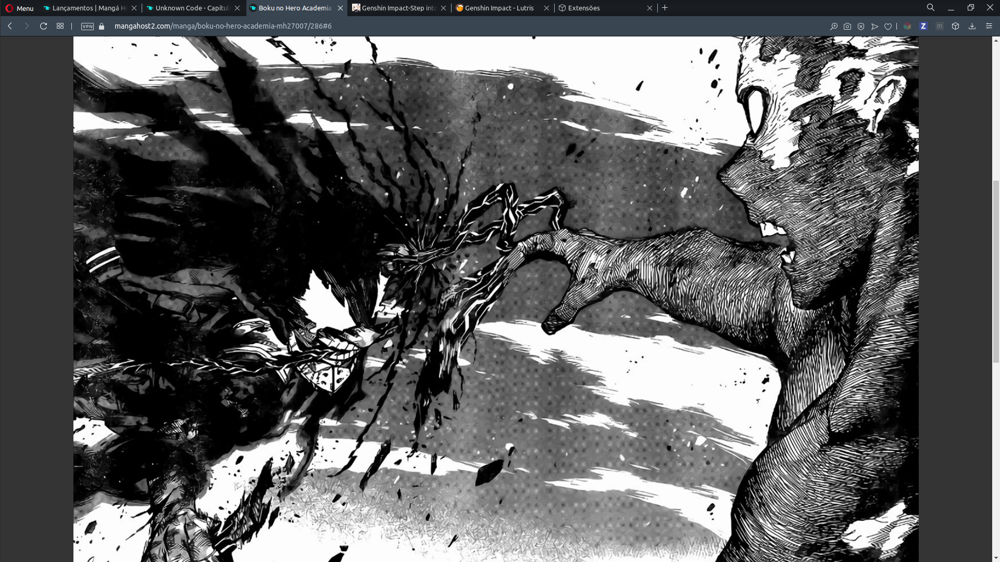
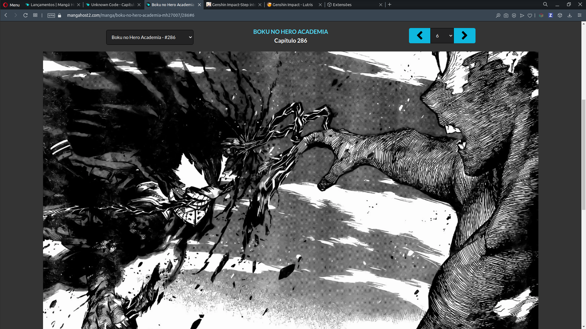

# Mangahost_navbar_fix

É feito para o site de leitura de mangas [mangahosted.com](https://mangahosted.com) (sua url muda com muita frequencia).

Um plugin de navegador com o intuito de ganhar pixels na imagem do manga escondendo a barra de navegação, que em minha opinião atrapalha a leitura.

## Exemplo

### Com o plugin

### Sem o plugin

## Como usar

1. clone este repositório ou baixe como zip e extraia em algum lugar da sua maquina.

1. digite `chrome://extensions` na barra de navegação e precione enter (alternativamente pode ir no menu de extensões do seu navegador).

2. Habilite o modo desenvolvedor que fica no canto superior direito.

3. Clique no botão `Carregar sem compactação` e escolha a pasta deste projeto.

Depois de seguir estes passos o plugin está pronto para uso, mais informações de instalações em https://developer.chrome.com/extensions/getstarted#manifest

Se encontrou um problema, abra uma issue descrevendo o problema em https://github.com/aquiles23/mangahost_navbar_fix/issues

Quer contribuir, escolha uma issue para trabalhar (ou crie uma) de acordo com o [guia de contribuição](./CONTRIBUTING.md), depois faça um pull request.
